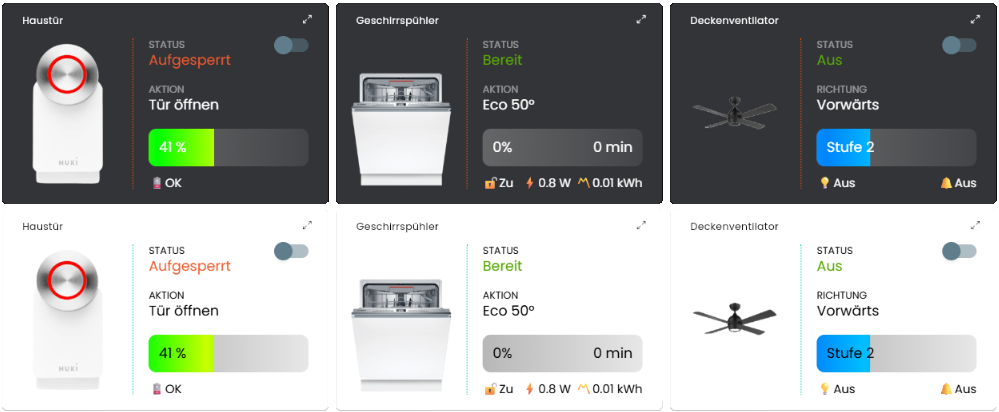

# 🎚️ Geräte-Widget (Device Widget)

Dieses Modul dient der Anzeige von Statusinformationen von Geräten als Kachel in der Tile Visualisierung.  
Ideal zur übersichtlichen Darstellung auf Dashboards.

## Inhaltverzeichnis

1. [Funktionsumfang](#user-content-1-funktionsumfang)
2. [Voraussetzungen](#user-content-2-voraussetzungen)
3. [Installation](#user-content-3-installation)
4. [Einrichten der Instanzen in IP-Symcon](#user-content-4-einrichten-der-instanzen-in-ip-symcon)
5. [Statusvariablen und Profile](#user-content-5-statusvariablen-und-profile)
6. [Visualisierung](#user-content-6-visualisierung)
7. [PHP-Befehlsreferenz](#user-content-7-php-befehlsreferenz)
8. [Versionshistorie](#user-content-8-versionshistorie)

### 1. Funktionsumfang

Durch Nutzung des HTML-SDKs kann dieses Widget Geräteinformationen und zusammenhängende Inhalte klar Strukturiert und kachelfüllend darstellen. Neben reiner textuellen Darstellung unterstützt das Modul Bilder, Fortschrittsbalken und einen Ein/Aus-Schalter.

### 2. Voraussetzungen

* IP-Symcon ab Version 8.1

### 3. Installation

* Über den Module Store das 'Geräte-Widget'-Modul installieren.
* Alternativ über das Module Control folgende URL hinzufügen  
`https://github.com/Wilkware/DeviceWidget` oder `git://github.com/Wilkware/DeviceWidget.git`

### 4. Einrichten der Instanzen in IP-Symcon

* Unter "Instanz hinzufügen" ist das _'Geräte-Widget'_-Modul unter dem Hersteller _'Geräte'_ aufgeführt.
Weitere Informationen zum Hinzufügen von Instanzen in der [Dokumentation der Instanzen](https://www.symcon.de/service/dokumentation/konzepte/instanzen/#Instanz_hinzufügen)

__Konfigurationsseite__:

_Einstellungsbereich:_

> ⬛ Kachel ...

Name                                | Beschreibung
------------------------------------|--------------------------------------------
Hintergrundfarbe                    | Transparent oder beliebiege Farbauswahl
Farbtransparenz                     | Durchsichtigkeit der gewählten Farbe von 0 bis 100%
Aufteilungsverhältnis               | Aufteilung Bild zu Informationen (von 20/80 bis 50/50)

> 🖼️ Bild ...

Name| Beschreibung
------------------------------------|--------------------------------------------
Statusbild (AN)                     | Angezeigtes Bild im eingeschaltetem oder aktiven Status
Statusbild (AUS)                    | Angezeigtes Bild im ausgeschaltetem oder inaktiven Status

> 🎚️ Schalter ...

Name                                | Beschreibung
------------------------------------|--------------------------------------------
Variable                            | Statusvariable (An/Aus, Auf/Zu usw.)
Type                                | Variablentyp (bool, int, float oder string)
Wert (AN)                           | Vergleichswert für Zustand AN, AUF oder AKTIV 
Wert (AUS)                          | Vergleichswert für Zustand AUS, ZU, INAKTIV

> ℹ️ Informationen  ...

Status (1.Zeilenbereich)            | Beschreibung
------------------------------------|--------------------------------------------
Beschriftung                        | Überschrift/Label für Variablenwert
Variable                            | Variablenwert selbst
Schriftgröße                        | zu verwendende Schriftgröße in Pixel
Statsuabhängige Darstellung         | Tabelle mit den ausgelesen möglichen Variablenwerten (Profile) und entsprechende Zurodnungen

Aktion (2.Zeilenbereich)            | Beschreibung
------------------------------------|--------------------------------------------
Beschriftung                        | Überschrift/Label für Variablenwert
Variable                            | Variablenwert selbst
Schriftgröße                        | zu verwendende Schriftgröße in Pixel

Fortschritt (3.Zeilenbereich)       | Beschreibung
------------------------------------|--------------------------------------------
Beschriftung                        | Überschrift/Label für Fortschritsbalken
Variable                            | Variablenwert selbst
Schriftgröße                        | zu verwendende Schriftgröße in Pixel
Restlaufzeit                        | Möglichkeit zur Angabe einer Variablen mit Reslaufzeitinformationen
Farbe(START)                        | Farbwert für Balkendarstellung (Start-Gradient)
Farbe(STOP )                        | Farbwert für Balkendarstellung (End-Gradient)

Zusätzliche Werte (4.Zeilenbereich) | Beschreibung (1. links, 2. mittig, 3. rechts)
------------------------------------|------------------------------------------------
Symbol                              | Zeichen oder Emoji für Info
Präfix                              | Text vor Variablenwert
Variable                            | Variablenwert
Suffix                              | Text nach Variablenwert
Schriftgröße                        | zu verwendende Schriftgröße in Pixel

### 5. Statusvariablen und Profile

Es werden keine zusätzlichen Statusvariablen/Profile benötigt.

### 6. Visualisierung

Das Modul kann direkt als Link in die TileVisu eingebunden werden.  
Die Kachel zeigt rechts im gewählten Seitenverhältnis das statusabhängige Bild, während auf der linken Seite bis zu vier Zeilen mit Statusinformationen dargestellt werden. Ein optionaler Schalter erscheint oben rechts in der Ecke.

### 7. PHP-Befehlsreferenz

Das Modul stellt keine direkten Funktionsaufrufe zur Verfügung.  

### 8. Versionshistorie

v1.1.20250916

* _NEU_: Projektumstrukturierung hin zu einer globalen CI/CD-Pipeline
* _FIX_: Fehler bei gleichem Wert für Min/Max für Fortschritsbalken behoben
* _FIX_: Dokumentation überarbeitet

v1.0.20250729

* _NEU_: Initialversion

## Danksagung

Ich möchte mich für die großartige Idee und Vorarbeit zu diesem Moduls bedanken bei ...

* _da8ter_ : für sein Vorbild-Modul __Geräte-Status Kachel__ 👍

Vielen Dank 🙏!

## Entwickler

Seit nunmehr über 10 Jahren fasziniert mich das Thema Haussteuerung. In den letzten Jahren betätige ich mich auch intensiv in der IP-Symcon Community und steuere dort verschiedenste Skript und Module bei. Ihr findet mich dort unter dem Namen @pitti ;-)

## Spenden

Die Software ist für die nicht kommerzielle Nutzung kostenlos, über eine Spende bei Gefallen des Moduls würde ich mich freuen.

## Lizenz

Namensnennung - Nicht-kommerziell - Weitergabe unter gleichen Bedingungen 4.0 International

